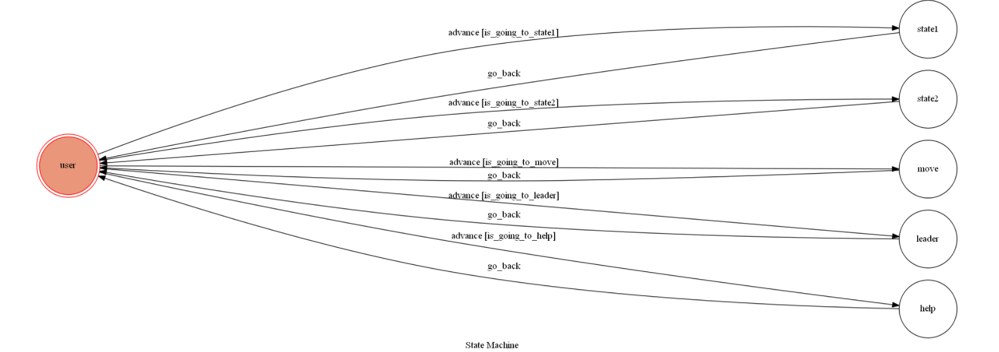

# TelegramBot

## 使用說明:

功能1:可以查詢NBA中文官網的頭條新聞，並在每條新聞前給個編號

功能2:輸入數字的話如果有對應的新聞會回復那個新聞連結，如果沒有對應的數字回復wrong input

功能3:可輸入常用的籃球術語:助攻、運球、動作、抄截、火鍋、灌籃，會回復當日最佳的指定動作，如果找不到會回復can't find

功能4:輸入"最佳數據"會顯示當日的得分王、籃板王、助攻王的指定數據

功能5:輸入"help"(不分大小寫)bot會教你如何使用
